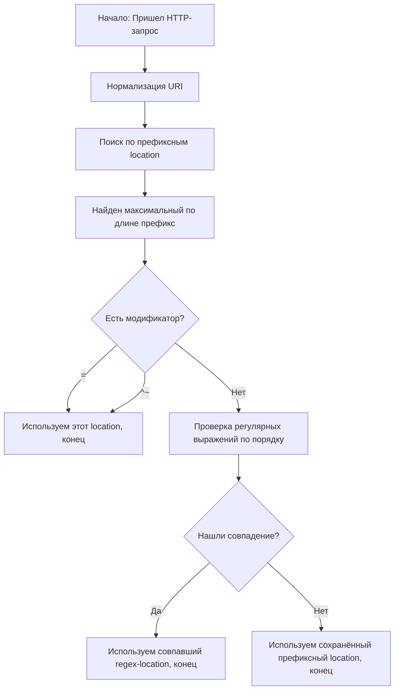
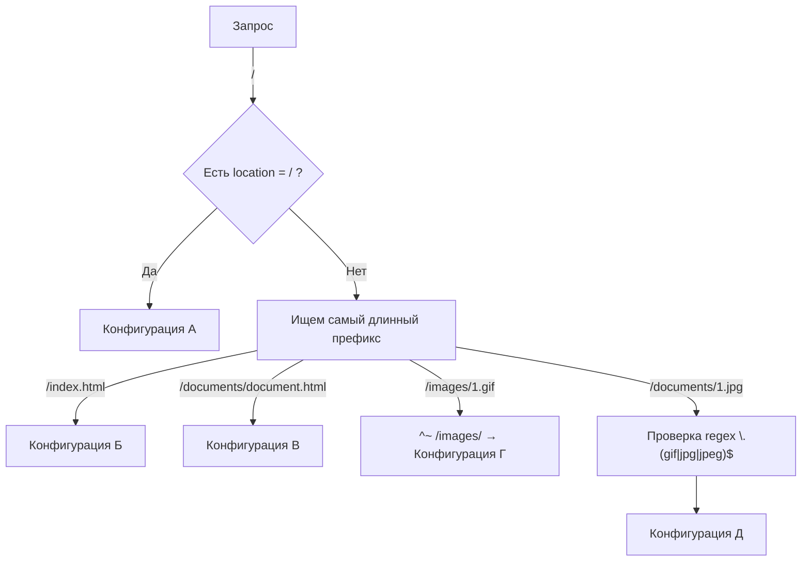

## 1. Общая логика работы

В `nginx` директива `location` управляет тем, какой блок конфигурации будет использован для обработки запроса, в зависимости от URI.

Сначала Nginx нормализует URI:

- Декодирует `%XX` (percent-encoding).
- Преобразует `.` и `..` в реальные пути.
- Заменяет подряд идущие `/` на один `/`.

---

## 2. Синтаксис

```nginx
location [ = | ~ | ~* | ^~ ] uri { ... }
location @name { ... }
```

**Контекст**: `server`, `location`.

**Модификаторы**:

| Модификатор | Описание                                                        |
| ----------- | --------------------------------------------------------------- |
| `=`         | Точное совпадение URI                                            |
| `^~`        | Префикс, при совпадении регулярки не проверяются                 |
| `~`         | Регулярное выражение (чувствительное к регистру)                |
| `~*`        | Регулярное выражение (без учёта регистра)                       |
| `@имя`      | Именованный location (для внутреннего перенаправления)          |

---

## 3. Алгоритм выбора location

1. **Поиск по префиксу** — находит самый длинный совпадающий префикс.
2. **Если у префикса есть `^~` или `=`** — выбор завершается, регулярки не проверяются.
3. **Поиск по регуляркам** — проверяются в порядке следования в конфиге, выбирается первое совпадение.
4. Если регулярки не подошли — используется запомненный префикс.

---

## 4. Важные особенности

- На ОС с нечувствительной к регистру ФС (macOS, Cygwin) префиксы сравниваются без учёта регистра.
- Регулярки могут содержать группы `()` и ссылки на них.
- Если префикс заканчивается `/` и используется `proxy_pass` или аналоги, то при запросе без `/` на конце Nginx вернёт **301** с добавлением `/`. Чтобы этого избежать — используйте `=`.

---

## 5. Примеры

```nginx
location = / {
    # Конфигурация A
}

location / {
    # Конфигурация Б
}

location /documents/ {
    # Конфигурация В
}

location ^~ /images/ {
    # Конфигурация Г
}

location ~* \.(gif|jpg|jpeg)$ {
    # Конфигурация Д
}
```

**Результат:**

| URI                        | Конфигурация |
| -------------------------- | ------------ |
| `/`                        | A            |
| `/index.html`              | Б            |
| `/documents/document.html` | В            |
| `/images/1.gif`            | Г            |
| `/documents/1.jpg`         | Д            |

Регулярки побеждают обычные префиксы, но проигрывают `=` и `^~`.

---

## 6. Предотвращение редиректа

```nginx
location /user/ {
    proxy_pass http://user.example.com;
}

location = /user {
    proxy_pass http://login.example.com;
}
```

Тут запрос `/user` не будет редиректиться на `/user/`.

---

## 7. Именованные location (@)

Используются только для внутренних перенаправлений:

```nginx
error_page 404 = @notfound;

location @notfound {
    return 404 "Custom Not Found";
}
```

---

## 8. Схема алгоритма



Порядок:
1. Нормализация URI (декодирование `%XX`, удаление `.`/`..`, замена `//` на `/`).
2. Поиск самого длинного совпадающего префиксного `location`.
3. Если у префикса модификатор `=` или `^~` — сразу используется он, регулярки не проверяются.
4. Иначе проверяются регулярки (`~` и `~*`) в порядке объявления в конфиге.
5. Первое совпадение с регуляркой побеждает.
6. Если ни одна регулярка не совпала — используется сохранённый префикс.

---

## 9. Визуализация примера из секции 5



- **`/`** — срабатывает `location = /` (A).
- **`/index.html`** — точного совпадения нет, берём `location /` (Б).
- **`/documents/document.html`** — берём более длинный префикс `location /documents/` (В).
- **`/images/1.gif`** — `^~ /images/` блокирует проверку регулярок, сразу конфигурация Г.
- **`/documents/1.jpg`** — префикс `/documents/`, но regex на `.jpg` даёт приоритет → конфигурация Д.

---
