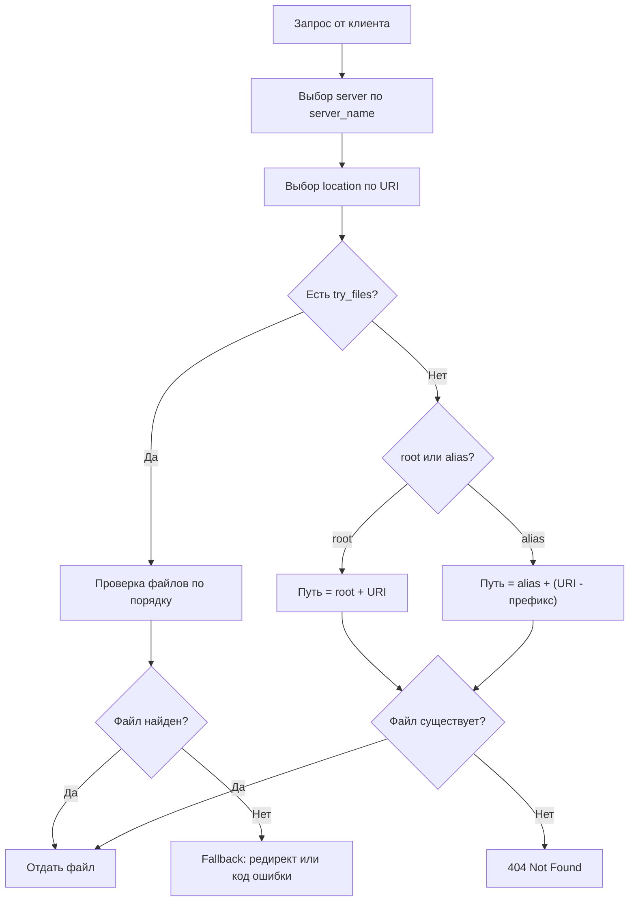

## 1. Директивы root и alias

### 1.1. root

Задаёт базовый каталог для поиска файлов. Полный путь формируется как `root + URI запроса`.

Контекст: `http`, `server`, `location`.

```nginx
server {
    listen 80;
    root /var/www/html;

    location /new {
        root /tmp;
    }
}
```

Пример работы с `root /var/www/html`:

```bash
mkdir -p /var/www/html/test/path && echo test > /var/www/html/test/path/hi.txt

curl -s http://example.org/test/path/hi.txt
# nginx берёт: /var/www/html + /test/path/hi.txt = /var/www/html/test/path/hi.txt
# Результат: 200 OK, содержимое "test"
```

Пример с `location /new` и `root /tmp`:

```bash
echo tmp > /tmp/hello.txt

curl -s http://example.org/new/hello.txt
# nginx берёт: /tmp + /new/hello.txt = /tmp/new/hello.txt
# Результат: 404 Not Found (файла /tmp/new/hello.txt нет)
```

URI запроса `/new/hello.txt` добавляется к `root` целиком, включая префикс location `/new`. Поэтому nginx ищет файл в `/tmp/new/hello.txt`, а не в `/tmp/hello.txt`.

### 1.2. alias

Отбрасывает префикс location из URI перед формированием пути. Полный путь: `alias + (URI - префикс location)`.

Контекст: `location`.

```nginx
server {
    listen 80;
    root /var/www/html;

    location /new {
        alias /tmp;
    }
}
```

```bash
curl -s http://example.org/new/hello.txt
# nginx берёт: /tmp + (/new/hello.txt - /new) = /tmp/hello.txt
# Результат: 200 OK, содержимое "tmp"
```

### 1.3. Сравнение root и alias

| Директива | Формула пути | Контекст |
|-----------|-------------|----------|
| `root` | `root + URI` | `http`, `server`, `location` |
| `alias` | `alias + (URI - префикс location)` | только `location` |

Типичная ошибка — использовать `root` там, где нужен `alias`:

```nginx
# Неправильно: ищет /static/assets/style.css
location /assets/ {
    root /static;
}

# Правильно: ищет /static/style.css
location /assets/ {
    alias /static/;
}
```

При использовании `alias` с location, заканчивающимся на `/`, значение alias тоже должно заканчиваться на `/`.

---

## 2. Именованные location (@)

Именованные location недоступны для внешних запросов — используются только для внутренних перенаправлений через `error_page`, `try_files` и др.

```nginx
server {
    listen 80;
    root /var/www/html;

    error_page 404 = @not_found;

    location @not_found {
        rewrite ^(.*)$ /hello.txt break;
        root /tmp;
    }
}
```

Если запрошенный файл не найден (404), управление передаётся в `@not_found`, где запрос переписывается на `/hello.txt` и ищется в `/tmp`.

---

## 3. Директива index

Определяет файлы, которые nginx ищет при запросе директории (URI заканчивается на `/` или не указывает на конкретный файл).

Контекст: `http`, `server`, `location`.

```nginx
server {
    listen 80;
    root /tmp;
    index hello.txt;
}
```

При запросе `http://example.org/` nginx будет искать `/tmp/hello.txt`.

Можно указать несколько файлов — nginx проверяет их по порядку:

```nginx
server {
    listen 80;
    root /var/www/site;
    index index.html index.php;
}
```

При запросе `http://example.org/blog/` nginx последовательно проверяет:

1. `/var/www/site/blog/index.html` — если существует, отдаёт его
2. `/var/www/site/blog/index.php` — если первый не найден, пробует второй

Т.е. `index` определяет какой файл подставить, когда клиент запрашивает директорию, а не конкретный файл.

---

## 4. Директива try_files

Проверяет существование файлов/директорий по порядку. Последний аргумент — fallback (URI для внутреннего редиректа или код ответа).

Контекст: `server`, `location`.

```
Синтаксис: try_files файл1 файл2 ... fallback;
```

### 4.1. Базовый пример — SPA приложение

```nginx
server {
    listen 80;
    root /var/www/app;

    location / {
        try_files $uri $uri/ /index.html;
    }
}
```

Порядок проверки:
1. `$uri` — существует ли файл (например `/styles.css`)
2. `$uri/` — существует ли директория с index-файлом
3. `/index.html` — fallback, если ничего не найдено

### 4.2. WordPress (PHP backend)

```nginx
server {
    index index.php;
    root /var/www/blog;

    location / {
        try_files $uri $uri/ /index.php?$args;
    }

    location ~ \.php$ {
        include fastcgi_params;
        fastcgi_intercept_errors on;
        fastcgi_pass php;
        fastcgi_param SCRIPT_FILENAME $document_root$fastcgi_script_name;
    }
}
```

Порядок:
1. Проверяется файл `$uri` — если есть (CSS, JS, изображение), отдаётся напрямую
2. Проверяется директория `$uri/` с `index.php` внутри
3. Fallback на `/index.php?$args` — передаёт обработку PHP

### 4.3. Проксирование в несколько S3 бакетов

Задача: отдавать файл из dev-бакета, если он там есть, иначе — из prod-бакета.

```nginx
server {
    listen 80;

    location / {
        try_files @dev @prod;
    }

    location @dev {
        proxy_http_version     1.1;
        proxy_set_header       Connection "";
        proxy_set_header       Authorization '';
        proxy_set_header       Host rebrain.dev.s3.amazonaws.com;
        add_header             Cache-Control max-age=31536000;
        proxy_pass             http://rebrain.dev.s3.amazonaws.com;
    }

    location @prod {
        proxy_http_version     1.1;
        proxy_set_header       Connection "";
        proxy_set_header       Authorization '';
        proxy_set_header       Host rebrain.prod.s3.amazonaws.com;
        add_header             Cache-Control max-age=31536000;
        proxy_pass             http://rebrain.prod.s3.amazonaws.com;
    }
}
```

### 4.4. Возврат кода ошибки как fallback

```nginx
location / {
    try_files $uri $uri/ =404;
}
```

Если файл и директория не найдены — возвращается 404.

---

## 5. Порядок обработки статического запроса


