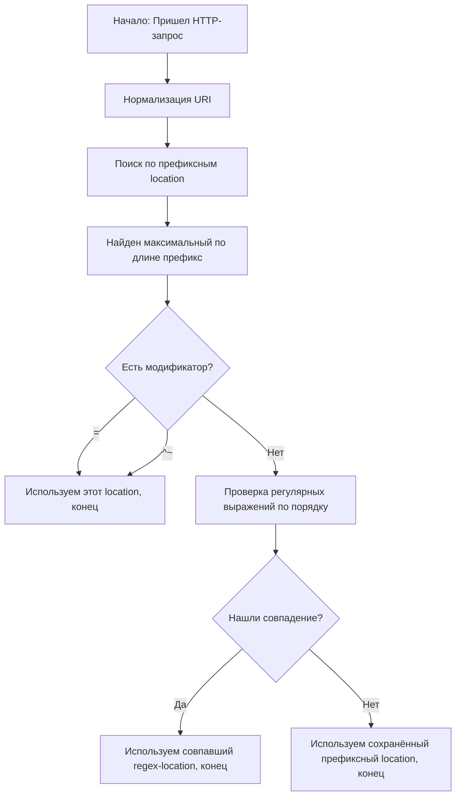
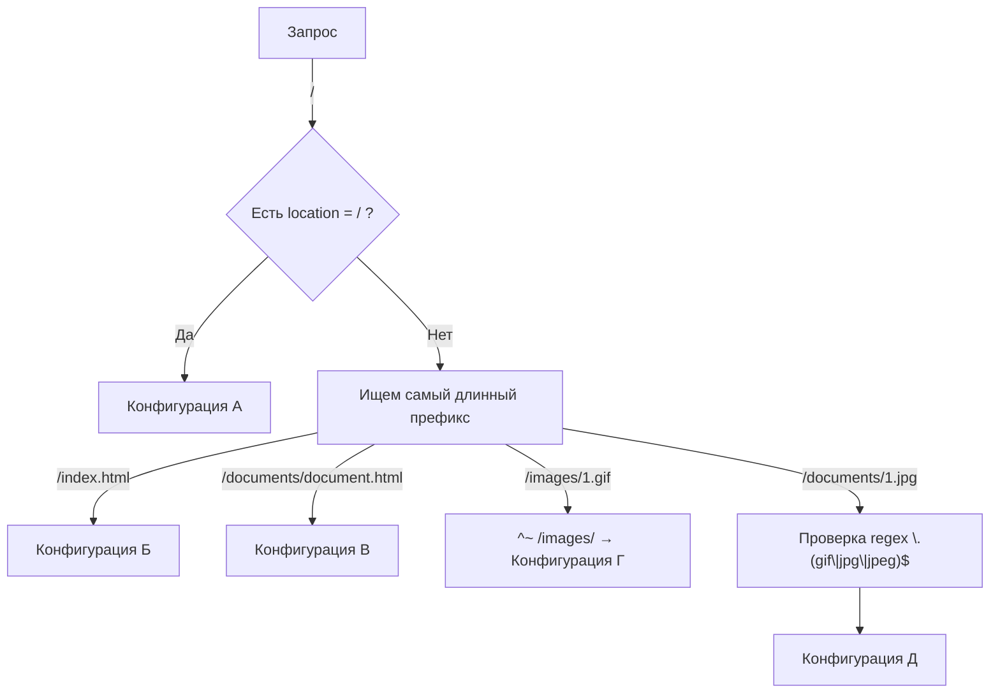

## Инструкция по `location` в Nginx
### 1. Общая логика работы

В `nginx` директива `location` управляет тем, какой блок конфигурации будет использован для обработки запроса, в зависимости от URI.

Сначала Nginx **нормализует** URI:

- Декодирует `%XX`.
  В URI могут встречаться символы в виде **percent-encoding** (кодировка URL).
  `%XX` — это шестнадцатеричное представление байта.
  Например:
    - `%20` → пробел (ASCII 32)
    - `%2F` → `/`
    - `%3A` → `:`
- Преобразует `.` и `..` в реальные пути.
- Заменяет подряд идущие `/` на один `/`.

---

### 2. Синтаксис

```nginx
location [ = | ~ | ~* | ^~ ] uri { ... }
location @name { ... }
```

- **Контекст**: `server`, `location`.
    
- **Модификаторы**:
    
    - `=` — точное совпадение URI.
    - `^~` — префикс, при совпадении регулярки не проверяются.
    - `~` — регулярное выражение (чувствительное к регистру).
    - `~*` — регулярное выражение (без учёта регистра).
    - `@имя` — именованный location (используется для внутреннего перенаправления, например, `error_page` или `try_files`).

---

### 3. Алгоритм выбора location

1. **Поиск по префиксу** — находит самый длинный совпадающий префикс.
2. **Если у префикса есть `^~` или `=`** — выбор завершается, регулярки не проверяются.
3. **Поиск по регуляркам** — проверяются в порядке следования в конфиге, выбирается первое совпадение.
4. Если регулярки не подошли — используется запомненный префикс.

---

### 4. Важные особенности

- На ОС с нечувствительной к регистру ФС (macOS, Cygwin) префиксы сравниваются без учёта регистра.
- Регулярки могут содержать группы `()` и ссылки на них.
- Если префикс заканчивается `/` и используется `proxy_pass` или аналоги, то при запросе без `/` на конце Nginx вернёт **301** с добавлением `/`. Чтобы этого избежать — используйте `=`.

---

### 5. Примеры

```nginx
location = / {
    # Конфигурация A
}

location / {
    # Конфигурация Б
}

location /documents/ {
    # Конфигурация В
}

location ^~ /images/ {
    # Конфигурация Г
}

location ~* \.(gif|jpg|jpeg)$ {
    # Конфигурация Д
}
```

Результат:
	
- `/` → **A**
- `/index.html` → **Б**
- `/documents/document.html` → **В**
- `/images/1.gif` → **Г**
- `/documents/1.jpg` → **Д**

  Регулярки в приоритете потом обычные локейшены
---

### 6. Пример с предотвращением редиректа `/` → `/`

```nginx
location /user/ {
    proxy_pass http://user.example.com;
}

location = /user {
    proxy_pass http://login.example.com;
}
```

Тут запрос `/user` не будет редиректиться на `/user/`.

---

### 7. Именованные location’ы (`@`)

Используются только для **внутренних** перенаправлений:

```nginx
error_page 404 = @notfound;

location @notfound {
    return 404 "Custom Not Found";
}
```

---




---

**Как читать схему:**

1. **Нормализация** — Nginx подготавливает URI (декодирует `%XX`, убирает `.`/`..`, заменяет `//` на `/`).
2. **Поиск по префиксу** — ищется самый длинный совпадающий `location`.
3. Если найден префикс с `=` или `^~` — сразу используется он.
4. Иначе проверяются **регулярки** (`~` и `~*`) в порядке объявления.
5. При первом совпадении с регекспом — он выбирается.
6. Если регулярка не нашлась — берётся ранее найденный **префикс**.[[]]

---



---

## Как работает схема:

- **`/`** → срабатывает `location = /` (A).
- **`/index.html`** → точного совпадения нет, берём `location /` (Б).
- **`/documents/document.html`** → берём более длинный префикс `location /documents/` (В).
- **`/images/1.gif`** → `^~ /images/` блокирует проверку регулярок, сразу конфигурация Г.
- **`/documents/1.jpg`** → префикс `/documents/`, но regex на `.jpg` даёт приоритет → конфигурация Д.
